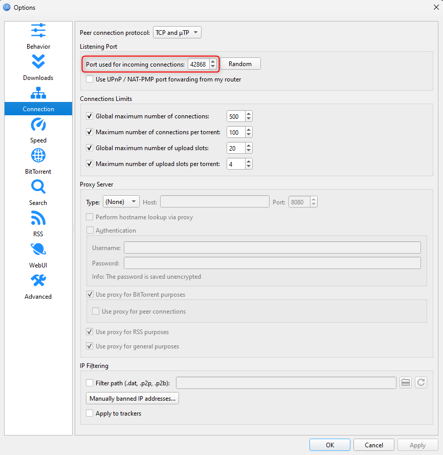
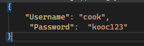

# qBittorrent incoming connection port setter for Proton VPN

## Index

- [About](#about)
- [Set up ProtonVPN and qBittorrent](#set-up-protonvpn-and-qbittorrent)
- [Configuration](#configuration)

## About

#### The application automates the setting up of the 'Port used for incoming connections' option in the qBittorrent client when used side by side with the ProtonVPN application for torrenting.

#### The common use-case scenario is the following - Once you connect to a P2P server in the ProtonVPN application, a new port is assigned to you on each connect/reconnect (if you have enabled the 'Port Forwarding option').

#### After the port is assigned to you, you will have to manually enter the port in the qBittorrent client on each ProtonVPN server connect/reconnect.

#### This application checks for port changes on every 10s, and sets the new port in the qBittorrent client.

#### Tested with qBittorrent v5.1.0 and ProtonVPN v4.3.11

## Set up ProtonVPN and qBittorrent

#### More information on how to set up the 'port fowarding' option in the ProtonVPN application can be found [here](https://protonvpn.com/support/port-forwarding).

#### In the qBittorrent client, you must enable the Web User Interface.

#### Go to: Tools -> Options -> WebUI

#### You should enable the check box (Web User Interface (Remote control))

#### Set the port to 8080

#### Uncheck the 'Use UPnP / NAT-PMP to forward the port from my router' option

#### In the Authentication section, please enter username and password. Later you will have to enter this information in the appsettings.json file. Check [how to set appsettings.json](#configuration)

## Configuration

#### Before launching the app, you should set the username and password in the appsettings.json file for the Web UI that you already set up in the qBitTorrent application [info](#set-up-protonvpn-and-qbittorrent).

